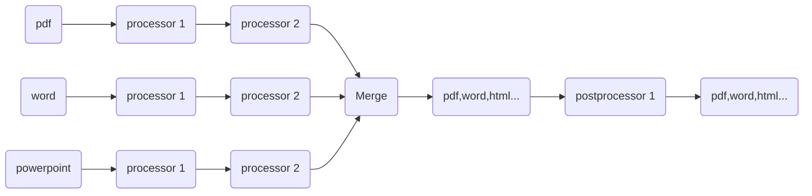

# Run

The simplest way to run the Document Factory is through the command line interface. This method can be utilized for 
executing the program locally and is also suitable for testing purposes. By leveraging the command line, 
users can quickly and easily initiate the Document Factory without the need for additional setup or configuration.

## Accessing the Installation Location

To begin using Document Factory, you will need to navigate to its installation directory and explore the specific contents 
within the `DocumentFactory\client` folder. Please follow the steps outlined below:

- Use the File Explorer application on your computer. You can open it by pressing Win + E on your keyboard.

- Locate the installation directory of Document Factory. This is typically found in C:\Program Files\DocumentFactory 
  unless you specified a different location during its installation.

- Within the DocumentFactory directory, find and open the client folder. 
  This folder contains essential files needed for various Document Factory operations.

## Executing Commands via Command Prompt

Once you have accessed the required folder, you will need to use the command prompt to perform specific tasks. 
In this scenario, you will use the executable ptfd8.exe to process your tasks.

- Press Win + R to open the Run dialog.
- Type cmd and press Enter.
- In the command prompt window, navigate to the client folder by executing the following command:
- 
```console
cd C:\Program Files\DocumentFactory\client
```

- If your installation location is different, replace the path accordingly.
- Run the executable with the desired parameters. Use the following format for your command:
- 
```console
./ptfd8.exe process -i <input> -o <output>
```

- Replace "input" with the path to your input file and "output" with the path where you want to save the processed output.

Example Command:
```console
./ptfd8.exe process -i C:\input -o C:\output
```

:::note
Ensure you have the necessary permissions to execute the command and access the specified input and output directories.
Double-check the file paths to avoid errors.
:::

The command execution with the default configuration enables to merge multiple DOCX files and convert the combined result into a PDF file. 
The DOCX files intended for merging should be placed in the specified input directory, and the resulting merged PDF will be available 
in the specified output directory.

The `--help` flag provides with detailed information about how to use the command-line interface (CLI) for ptfd8.exe. 
When this option is used, it displays a comprehensive guide including the available commands, options, and their descriptions.

```console
./ptfd8.exe --help
```

## Pipeline

For the previously described version of the command execution, the default value of the pipeline is `DocumentFactory\client\pipeline.json`.

However, it also allows for customization by specifying the desired value as a parameter:

```console
./ptfd8.exe process -i <input> -o <output> -p <pipeline>
```

Example Command:
```console
./ptfd8.exe process -i C:\input -o C:\output -p C:\pipeline\pipeline.json
```

The `DocumentFactory\client\pipeline.json` file contains a JSON structure that specifies the pipeline configuration for 
the Document Factory. This pipeline outlines the set and sequence of actions that the Document Factory executes during 
the document processing workflow.

### Structure

The JSON structure in `pipeline.json` typically includes several key steps such as **processors**, **merge**, and **postprocessors**. 
Each stage represents a step in the pipeline, and each action defines a specific task to be performed.


Description:  
**Processor**: A list of tasks responsible for executing key operations on the documents, 
such as converting them to another format or OCR.  
**Merge**: Compiling multiple documents into a unified document.  
**Postprocessor**: A process that changes or improves the result after the initial operation is complete, 
such as watermarking, signature, or compression.
Postprocessors can be used to add additional features or perform any cleaning tasks on the final document.



### Purpose

The purpose of this configuration is to define and customize the document processing pipeline. 
It allows for the specification of which actions are performed, in what order, and with what parameters. 
This enables detailed control over the document processing workflow, 
ensuring that each necessary step is executed efficiently and correctly.

This documentation contains detailed explanations of the parameters that can be used in the pipeline configuration. 
Each parameter is thoroughly described to provide clarity on its purpose and usage within the pipeline. 
Understanding these parameters is crucial for customizing and optimizing the document processing workflow.

It is recommended to edit the pipeline.json file or custom pipeline file by opening it in Visual Studio Code.
Use this documentation as well as the [configured Visual Studio Code autocomplete](./setup.mdx) 
to create a pipeline that will work for your specific use case.
