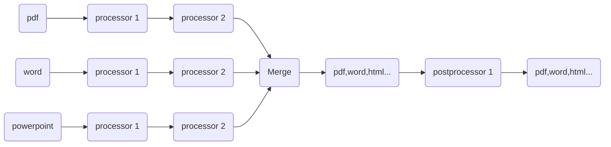

# Terminology & Concepts

This section provides definitions and explanations of fundamental terms and concepts used throughout the documentation.
It serves as a reference point for understanding how DocumentFactory works at a conceptual level.

## Pipeline

A pipeline is the core configuration element that defines how documents are processed in **DocumentFactory**. I
It specifies the sequence of operations applied to incoming files, enabling a flexible and automated transformation workflow.

The pipeline configuration includes the following logical components:

- **Processors** – define the primary operations on individual files, such as format conversion or Optical Character Recognition (OCR).

- **Merge** – controls whether multiple documents should be combined into a single output file.

- **Postprocessors** – specify operations that are applied after the main processing steps, such as adding watermarks or compressing output files.

DocumentFactory uses the pipeline to determine exactly what should happen to each document and in what order. Whether converting documents, enhancing them for search, or preparing them for long-term archiving, the pipeline provides a structured and reusable way to define processing rules.

The pipeline is provided as a JSON-formatted input parameter when starting a processing task. It can be created and modified manually or through available user interfaces.

In essence, the pipeline is the central control point that guides document transformation—enabling automation, consistency, and efficiency across all processed content.

## Workflow

A workflow is the runtime process in which a defined pipeline is applied to actual input data. It represents the execution phase,
where documents or folder structures are processed step by step according to the pipeline’s logic. Each workflow instance is tied
to a specific set of input and operates independently to produce results.

## Task

A **Task** is the fundamental unit of execution within a workflow. Each task represents the execution of a single step:
either an operation from the `Processors` list, an operation from the `Postprocessors` list, or a Merge action performed
on a specific document or group of documents.

This approach breaks down the document processing lifecycle into manageable, discrete actions,
each encapsulated as a separate task.

## Job Processor

A **Job Processor** is a specialized component in the execution pipeline, instantiated based on the file extension of the
document being processed. For each incoming file—whether it be a PDF, Word document, image, or another supported format —
the system selects the appropriate Job Processor (e.g., PDFProcessor, WordProcessor, ImageProcessor) tailored to handle that file type.

The primary responsibility of the Job Processor is to interpret the task configuration and determine the set of actions
that need to be applied to the document. Based on this configuration, the Job Processor creates one or more
Document Processors, each responsible for carrying out a specific action as defined by the pipeline (such as merging documents,
converting formats, or applying watermarks).

## Document Processor

A **Document Processor** operates at a finer level of granularity than the Job Processor. While the Job Processor manages
the overall logic for a document or group of documents, the Document Processor executes individual actions assigned to it
by the Job Processor. Each Document Processor is configured according to the specifics of a task—performing actions
such as merging, converting, or watermarking on the actual content of a document.

The relationship between Job Processors and Document Processors is determined by the structure of operations within the pipeline:

- If a processor operation (in either the Processors or Postprocessors list) consists of a single action, the Job Processor
will create exactly one corresponding Document Processor for that task.
- If an operation defines multiple actions—such as a composite operation that involves several steps—the Job Processor splits
these actions, creating a separate Document Processor for each one.

