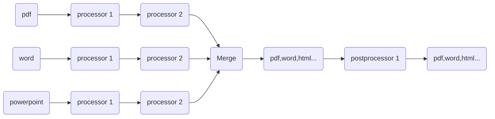

# Terminology & Concepts

This section provides definitions and explanations of fundamental terms and concepts used throughout the documentation.
It serves as a reference point for understanding how DocumentFactory works at a conceptual level.

## Pipeline

A pipeline is the core configuration element that defines how documents are processed in **DocumentFactory**. I
It specifies the sequence of operations applied to incoming files, enabling a flexible and automated transformation workflow.

The pipeline configuration includes the following logical components:

- **Processors** – define the primary operations on individual files, such as format conversion or Optical Character Recognition (OCR).

- **Merge** – controls whether multiple documents should be combined into a single output file.

- **Postprocessors** – specify actions that are applied after the main processing steps, such as adding watermarks or compressing output files.

DocumentFactory uses the pipeline to determine exactly what should happen to each document and in what order. Whether converting documents, enhancing them for search, or preparing them for long-term archiving, the pipeline provides a structured and reusable way to define processing rules.

The pipeline is provided as a JSON-formatted input parameter when starting a processing task. It can be created and modified manually or through available user interfaces.

In essence, the pipeline is the central control point that guides document transformation—enabling automation, consistency, and efficiency across all processed content.
